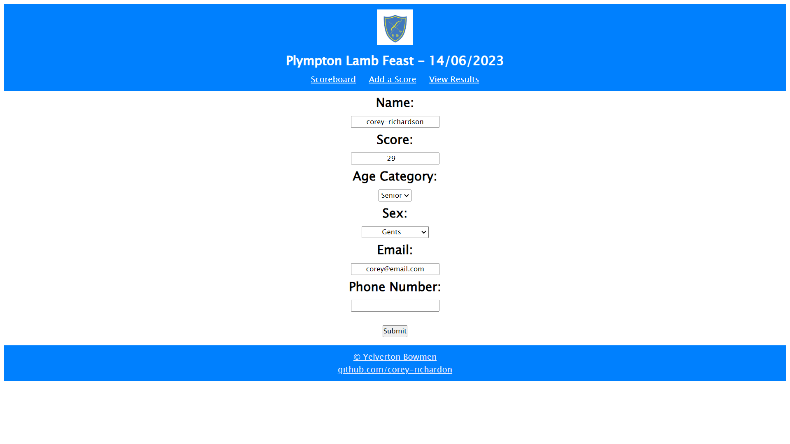
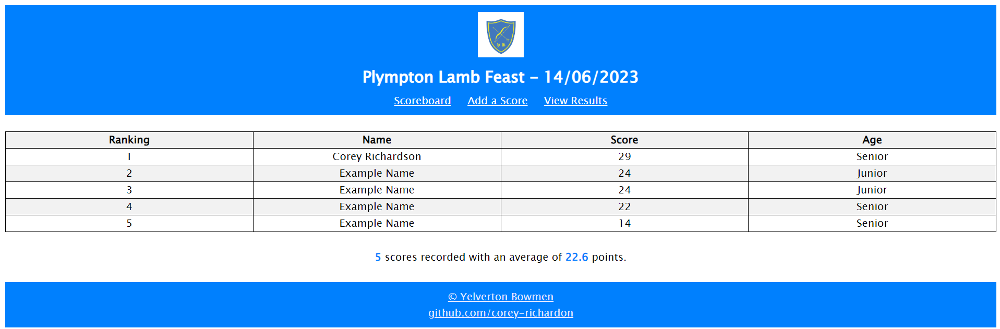
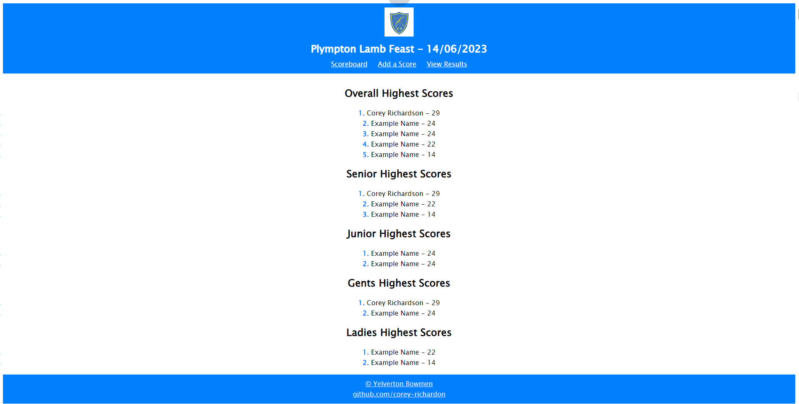

# Yelverton Bowmen Score Display

`// TO UPDATE`

---

## Contents

- [user-manual](#user-manual)
    - [running-the-flask-project](#running-the-flask-project)
    - [setting-up](#setting-up)
    - [add-a-score](#add-a-score)
    - [scoreboard](#scoreboard)
    - [final-results](#final-results)
    - [clearing-the-scores](#clearing-the-scores)
    - [close-web-app](#close-web-app)
- [installation-guide](#installation-guide)
- [software-description](#software-description)
    - [app](#app)
        - [imports](#imports)
        - [define-constants](#define-constants)
        - [flask-initialisation](#flask-initialisation)
        - [event-initialisation](#event-initialisation)
        - [webbrowser](#webbrowser)
        - [index-route-scoreboard](#index-route-scoreboard)
        - [add-score-route](#add-score-route)
        - [results-route-and-grouper-function](#results-route-and-grouper-function)
    - [forms](#forms)
    - [templates](#templates)
        - [base-template](#base-template)
        - [index-template](#index-template)
        - [add-score-template](#add-score-template)
        - [results-template](#results-template)
    - [stylecss](#stylecss)
        - [variables](#variables)
        - [global-styling](#global-styling)
        - [navigation-bar](#navigation-bar)
        - [footer](#footer)
        - [text](#text)
        - [links](#links)
        - [tables](#tables)

---

Intended for use at community events, such as the annual Plympton Lamb Feast.

---

## User Manual

### Running the Flask Project

```
cd yb_score_display
```

*Windows:*
```
Scripts\activate
flask run
```
*Linux:*
```
source bin/activate
flask run
```

If you want to run in "debug" mode, allowing code changes whilst the app is running:
```
flask run --debug
```

### Setting Up

The script will then ask for the event name in the console terminal.
```
Event Name:
```

Type the name of the event and press the <kbd>Enter</kbd> key to continue.
```
Event Name: Plympton Lamb Feast
 * Debugger is active!
 * Debugger PIN: XXX-XXX-XXX
127.0.0.1 - - [14/Jun/2023 14:29:11] "GET / HTTP/1.1" 200 -
...
```

### Add a Score

To add a new score, click on the 'Add a Score' button in the top navigation bar. This will bring up a form to be filled in.

Label | Field Type | Required
--- | --- | ---
Name | String Field | :heavy_check_mark:
Score | Integer Field | :heavy_check_mark:
Age Category | Dropdown Box | :heavy_check_mark:
Sex | Dropdown Box |  :heavy_check_mark:
Email | Email Validation Field | :x:
Phone Number | String Field | :x:

> `Sex` is a required field however there is an option to select 'Prefer not to say'. <br>
> Phone Number is a `StringField` rather than an `IntegerField` to avoid stripping the starting '0' at the start of UK style phone numbers.




### Scoreboard

As new scores are added, the scoreboard updates, sorting itself from highest to lowest score acheived.



The scoreboard also measures the number of entries, as well as the average score.

### Final Results

At the *cessation* of activities, use the 'View Results' tab, found in the upper navigation bar to display the top **five** (or other as set by `N_WINNERS` in `app.py`) scores for each of the following categories:
- Overall
- Seniors
- Juniors
- Gents
- Ladies



### Clearing the Scores

To clear the scores, navigate to `static/scores.csv` and paste the following, overwriting and pre-existing data:
```
name,score,age_category,sex,email,phone_num

```
> NOTE: The empty new-line after the headers is REQUIRED.

### Close Web App

To close the web app, type `deactivate` into the terminal window.
```
(plympton_lamb_feast) @corey-richardson ➜ /workspaces/yelverton-bowmen-scoreboard/yb_score_display (main) $ deactivate
@corey-richardson ➜ /workspaces/yelverton-bowmen-scoreboard/yb_score_display (main) $ 
``` 

---

## Installation Guide to Run Locally

- Install VS Code, or equivalent code editor / IDE.
- Install Python (3.11.X), including PIP.
- Download zip file from GitHub, or if Git is installed, clone the repository.
- Use PIP to install dependencies.
```
pip install flask
pip install flask_wtf
pip install pandas
pip install webbrowser
```

---

## Software Description

### App

#### Imports

```py
# Flask Imports
from flask import Flask, render_template, redirect, url_for
from forms import GetScoreData
# Pandas - dataframe management
import pandas as pd
# Datetime - used to get todays date
from datetime import date
# Auto-open web browser to page
import webbrowser
# Used to check for 'nan' values
import math
```

#### Define Constants

```py
PATH = "static/scores.csv"
# How many names to display:
N_WINNERS = 5
```

#### Flask Initialisation

```py
# Flask setup
app = Flask(__name__)
app.config['SECRET_KEY'] = 'mysecret'
```

#### Event Initialisation

Set event name and current date. These are passed into the navigation bar in the template `base.html`.

```py
event = "Plympton Lamb Feast"
# Get date, format into DD/MM/YYYY
today = date.today().strftime("%d/%m/%Y")

@app.context_processor
def set_event():
    return dict(event_name=event, date=today)
```

#### Webbrowser

```py
# Open the flask app in a web browser
# Home IP, Port 5000
webbrowser.open("http://127.0.0.1:5000/")
```

#### Index Route / Scoreboard

When the index route is opened or redirected to, use the `Pandas` module to read the current score data into a DataFrame object named `score_data`. Sort these values by score from highest to lowest.

Get the number of entries and the average score; these summary statistics are displayed at the bottom of the page.

If `score_data` is empty, `.mean()` will return a 'not a number' object - resolve this by setting the average score to 0 if this is the case.

Convert `score_data` to a list and pass it to the template `index.html`.

```py
@app.route('/', methods=["GET","POST"])
def index():
    score_data = pd.read_csv(PATH)
    score_data = score_data.sort_values(by=["score"], ascending=False)
    
    count = score_data.shape[0]
    avg_score = score_data.score.mean()
    if math.isnan(avg_score): avg_score = 0
    
    score_data = score_data.values.tolist()
    
    return render_template(
        "index.html", 
        score_data=score_data,
        count=count,
        avg_score=avg_score
    )
```

#### Add Score Route

Create an instance of the form class `GetScoreData`. If the form has not been submitted, render the `add_score.html` template. This template gets user input as specified by `forms.py`. More information regarding the form can be found [here](#forms).

Once the form is validated, write each input to `scores.csv` and redirect back to the index route / scoreboard.

```py
@app.route('/add_score', methods=["GET","POST"])
def add_score():
    get_score_data = GetScoreData()
    if get_score_data.validate_on_submit():
        name = get_score_data.name.data
        score = get_score_data.score.data
        age_category = get_score_data.age_category.data
        sex = get_score_data.sex.data
        email = get_score_data.email.data
        phone_num = get_score_data.phone_num.data
        
        with open(PATH, "a") as score_file:
            line = f"{name},{score},{age_category},{sex},{email},{phone_num}\n"
            score_file.write(line)
            
        return redirect(url_for(
            "index", _external=True, scheme="https"
        ))
        
    return render_template(
        "add_score.html", get_score_data=get_score_data
    )
```

#### Results Route and Grouper Function

The `grouper` function takes in a grouped-by DataFrame and converts the top `N_WINNERS` values to a list. If the DataFrame is empty or does not contain enough values, it will return an empty but valid list.

The results route reads and sorts the `scores.csv` file into a DataFrame. It then gets the overall top scores and using the `grouper` function gets the top scores for categorys Junior, Senior, Gents and Ladies. These get passed into the `results.html` template.

```py
def grouper(grouped_data, name):
    try:
        lst = grouped_data.get_group(name).head(N_WINNERS).values.tolist()
    except KeyError:
        lst = [["",""]]
        print(f"{name} list empty.")
    return lst

@app.route('/results', methods=["GET","POST"])
def results():
    score_data = pd.read_csv(PATH)
    score_data = score_data.sort_values(by=["score"], ascending=False)
    
    overalls = score_data[["name","score"]].head(N_WINNERS).values.tolist()
    if len(overalls) == 0: overalls = [["",""]] # If data empty
    
    age_grouped = score_data.groupby(score_data.age_category)
    seniors = grouper(age_grouped, "Senior")
    juniors = grouper(age_grouped, "Junior")
        
    sex_grouped = score_data.groupby(score_data.sex)
    gents = grouper(sex_grouped, "Gents")
    ladies = grouper(sex_grouped, "Ladies")
    
    return render_template(
        "results.html",
        overalls=overalls,
        seniors=seniors,
        juniors=juniors,
        gents=gents,
        ladies=ladies
    )
```

### Forms

```py
from flask_wtf import FlaskForm
from wtforms import SubmitField, StringField, SelectField, EmailField, IntegerField, TelField
from wtforms.validators import DataRequired
# validators.required(), validators.length(max=10)]

class GetScoreData(FlaskForm):
# Name, Score, Age Category, Email, Phone Number
    name = StringField("Name: ", validators=[DataRequired()])
    score = IntegerField("Score: ", validators=[DataRequired()])
    age_category = SelectField("Age Category: ", choices=["Senior", "Junior"])
    sex = SelectField("Gender: ", choices=["Gents", "Ladies", "Prefer not to say", "Other"])
    email = EmailField("Email: ")
    phone_num = StringField("Phone Number: ")
    
    submit = SubmitField("Submit")
```

### Templates

#### Base Template

Contains the navigation bar and footer featured on each page. All other templates extend from `base.html`.

```html
<!DOCTYPE html>
<html lang="en">

  <head>
    <link rel="stylesheet" href="../static/style.css">
    
    <title>Yelverton Bowmen of Plymouth</title>
    <link rel="icon" type="image/png" href="../static/imgs/logo.png"/>
  </head>

  <body>
    <nav>
        
        <h2>{{ event_name }} - {{ date }}</h2>
        <a href="/">Scoreboard</a>
        <a href="/add_score">Add a Score</a>
        <a href="/results">View Results</a>
    </nav>

    <div id="main">
    
    
    </div>

    <footer>
        <p>
            <a href="https://yelvertonbowmen.co.uk" target="_blank">&copy Yelverton Bowmen</a>
            <br> <a href="https://github.com/corey-richardson" target="_blank">github.com/corey-richardon</a>
        </p>
    </footer>

  </body>
</html>
```

#### Index Template

Create a table with columns Ranking, Name, Score and Age. For each row in the `score_data` list previously passed in by the index route, add a row to the table with the respective values. The Ranking column is populated by the loop index plus 1 (zero-indexed): `loop.index0 + 1`.

Also, display the number of entries and the average score achieved.

```html


<br>
<table>
    <tr>
        <tr>
            <th>Ranking</th>
            <th>Name</th>
            <th>Score</th>
            <th>Age</th>
        </tr>
    </tr>
    <tbody>
        
        <tr>
            <td>{{loop.index0 + 1}}</td>
            <td>{{row[0]}}</td>
            <td>{{row[1]}}</td>
            <td>{{row[2]}}</td>
        </tr>
        
    </tbody>
</table>
<p><b>{{ count }}</b> scores recorded with an average of <b>{{ avg_score | round (2) }}</b> points.</p>

```

#### Add Score Template

```html



<form method="post">

    {{ get_score_data.hidden_tag() }}

    <h2> {{ get_score_data.name.label }} </h2>
    {{ get_score_data.name() }}
    <h2> {{ get_score_data.score.label }} </h2>
    {{ get_score_data.score() }}
    <h2> {{ get_score_data.age_category.label }} </h2>
    {{ get_score_data.age_category() }}
    <h2> {{ get_score_data.sex.label }} </h2>
    {{ get_score_data.sex() }}
    <h2> {{ get_score_data.email.label }} </h2>
    {{ get_score_data.email() }}
    <h2> {{ get_score_data.phone_num.label }} </h2>
    {{ get_score_data.phone_num() }}

    <br><br>
    {{ get_score_data.submit() }}

</form>


```

#### Results Template

Display the scores for each person in the top scores list, by category and overall scores.

```html


<br>

<h2>Overall Highest Scores</h2>
<ol>
    
        <li><b>{{loop.index0 + 1}}.</b> {{ person[0] }} - {{ person[1] }}</li>
    
</ol>

<h2>Senior Highest Scores</h2>
<ol>
    
        <li><b>{{loop.index0 + 1}}.</b> {{ person[0] }} - {{ person[1] }}</li>
    
</ol>

<h2>Junior Highest Scores</h2>
<ol>
    
        <li><b>{{loop.index0 + 1}}.</b> {{ person[0] }} - {{ person[1] }}</li>
    
</ol>

<h2>Gents Highest Scores</h2>
<ol>
    
        <li><b>{{loop.index0 + 1}}.</b> {{ person[0] }} - {{ person[1] }}</li>
    
</ol>

<h2>Ladies Highest Scores</h2>
<ol>
    
        <li><b>{{loop.index0 + 1}}.</b> {{ person[0] }} - {{ person[1] }}</li>
    
</ol>



```

### style.css

#### Variables

Set colour variables corresponding to Yelverton Bowmen HEX Codes.

```css
:root {
    --yb_blue: #0080FE;
    --yb_yellow: #FFFC00;
    --yb_light_blue: #E0E8FF;
    --yb_dark_blue: #002447;
}
```

#### Global Styling

- Sets the font to "Lucida Grande or Lucida Sans Unicode.
- Sets the padding to no padding.
- Centre aligns all text. 
> The `font-family` property can hold several font names as a "fallback" system. If the browser does not support the first font, it tries the next font.

```css
* {
    font-family: "Lucida Grande", "Lucida Sans Unicode";
    padding: 0;
    text-align: center;
}
```

#### Navigation Bar

- Set the background colour of the navigation bar to `--yb_blue` / `#0080FE`.
- Set elements to vertically align themselves centrally in their boxes.
- Set text colour to white.
- Set vertical padding to 10 pixels; horizontal padding remains as none.
- `h1` and `h2` elements has a 5 pixel margin on all sides.
- `img` elements have a height and width of 70 pixels.

```css
nav {
    background-color: var(--yb_blue);
    vertical-align: middle;
    color: white;
    padding: 10px 0;
}

nav h1, h2 {
    margin: 5px;
}

nav img {
    height: 70px;
    width: 70px;
    margin: 0;
}
```

#### Footer

- Set the background colour of the navigation bar to `--yb_blue` / `#0080FE`.
- Sets text colour to `--yb_light_blue` / `#E0E8FF`
- Sets `a` elements (links) to have a colour of  `--yb_light_blue` / `#E0E8FF` with a 15 pixel margin.
```css
footer {
    background-color: var(--yb_blue);
    color: var(--yb_light_blue);
}

footer a {
    color: var(--yb_light_blue);
    border-radius: 15px;
}
```

#### Text

- `h1` header elements have a vertical padding of 30 pixels and no horizontal padding.
- `h1` header elements have a font size of 40 pixels.
- `p` paragraph elements have a vertical padding of 10 pixels and no horizontal padding.
- `b` bold elements have a text colour of `--yb_blue` / `#0080FE`.
```css
h1 {
    padding: 30px 0;
    font-size: 40px;
}

p {
    padding: 10px 0;
}

b {
    color: var(--yb_blue);
}
```

#### Links

- `a` elements have a text colour of white.
- `a` elements have a border with radius 15 pixels.
- The area within this border is `--yb_blue` / `#0080FE` in colour.
- `a` elements have 10 pixels of horizontal padding; they have no vertical padding.
- when hovered over, the text of `a` elements changes to `--yb_blue` / `#0080FE` and the border changes to `--yb_dark_blue` / `#002447`

```css
a {
    color: white;
    border-radius: 15px;
    background-color: var(--yb_blue);
    padding: 0 10px;
}

a:hover {
    color: var(--yb_blue);
    background-color: var(--yb_dark_blue);
}
```

#### Tables

- Table headers `th` are bold.
- `table`, `th`, `td` and `tr` elements have a 1 pixel wide solid black border.
- The `border-collapse` property sets whether table borders should collapse into a single border or be separated as in standard HTML.
- The `table` is given a width of 100% of the page.
- Table header `th` and table data `td` elements are given a width of 20% of the page.
- Every even-th indexed row is given a light grey colour to help with user readability.

```css
th {
    font-weight: bold;
}

table, th, td, tr {
    border: 1px solid black;
    border-collapse: collapse;
  }

table {
    width: 100%;
}

th, td {
    width: 25%;
}

tr:nth-child(even) {
    background-color: #f2f2f2;
}
```
